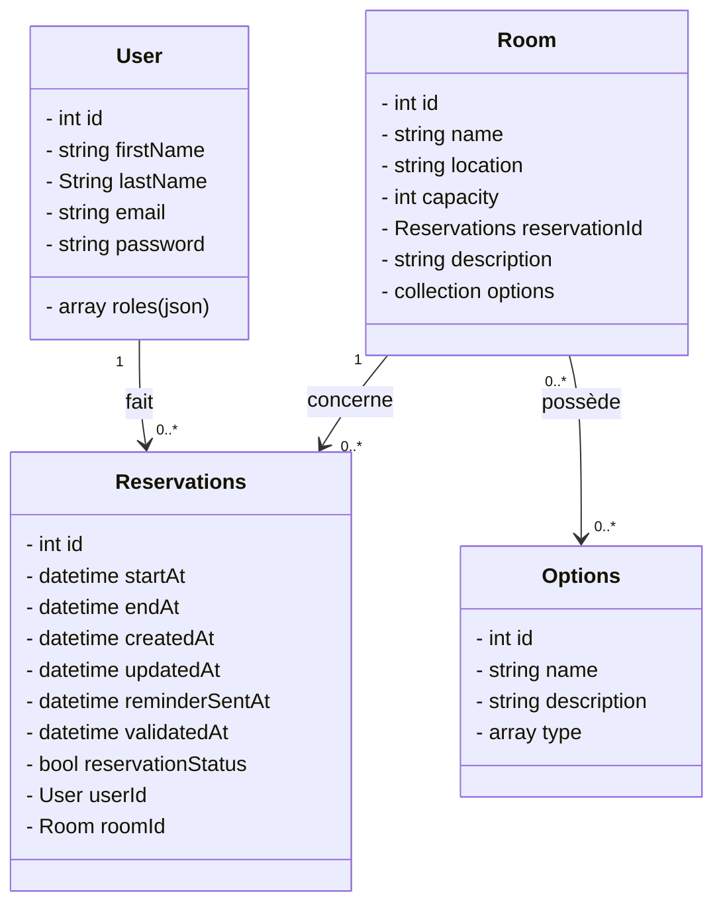

Diagramme de classe d'une application de réservation de salle de réunion.

```mermaid
classDiagram

    class User {
        - int id
        - string firstName
        - String lastName
        - string email
        - string password
        - array roles (json)
    }

    class Room {
        - int id
        - string name
        - string location
        - int capacity
        - Reservations reservationId
        - string description
        - collection options
    }

    class Options {
        - int id
        - string name
        - string description
        - array type
    }

    class Reservations {
        - int id
        - datetime startAt
        - datetime endAt
        - datetime createdAt
        - datetime updatedAt
        - datetime reminderSentAt
        - datetime validatedAt
        - bool reservationStatus
        - User userId
        - Room roomId
    }

    User "1" --> "0..*" Reservations : fait
    Room "1" --> "0..*" Reservations : concerne
    Room "0..*" --> "0..*" Options : possède

```